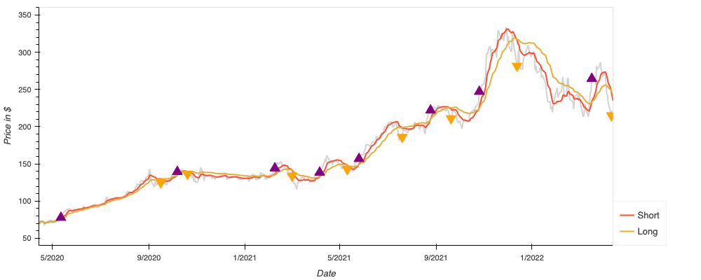
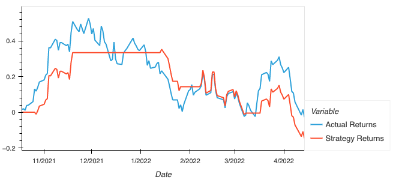
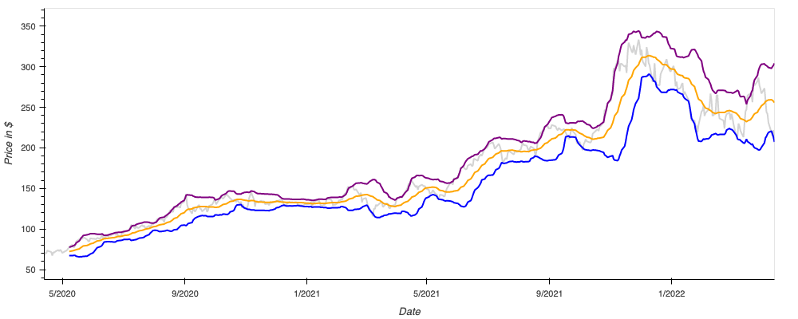
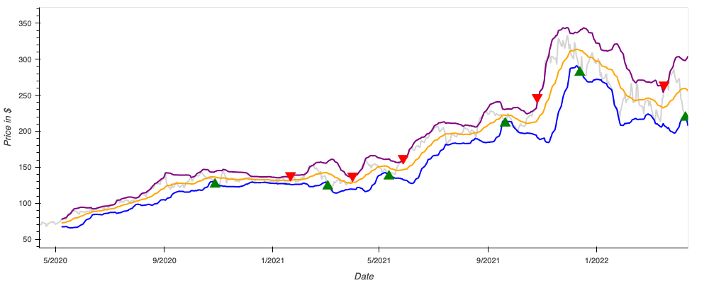

# UofM-FinTech-Project-2

### Abib Ajibola
### Latoya Springer
### Timothy Wardlow

## Project Summary
* Exploring the importance of choosing technical indicators and the impact they have on algorithmic trading strategies.
* Dual Moving Averages Crossover versus Bollinger Bands— which technical indicator provides the better outcome? 
* What would our strategies look like on predicted data?

## Predictive Models Used
* Support Vector Classification
* Gaussian Processes Classification
* Long Short Term Memory Network

## Data Sources
* Historical stock data extracted from yfinance library 

## Analysis and Conclusion
* For our DMAC strategy, the Support Vector Classification model had a higher F1 Score (0.63) than the Gaussian Process Classification model (0.55). We would not feel confident about using either model based on the classification reports.
* For our Bollinger Bands strategy, we were able to show optimal points of entry and exit on the real closing data as well as our predicted closing data. 

## Postmortem
* There weren’t enough Signal instances in our Bollinger Bands strategy to do our original hypothesis of testing different short and long windows against each other using machine learning models to predict Entry/Exit.
* If we had more time to work on this project we would have loved to explore using TensorTrade.

### Dual Moving Averages Crossover Strategy

### Bollinger Bands Strategy

